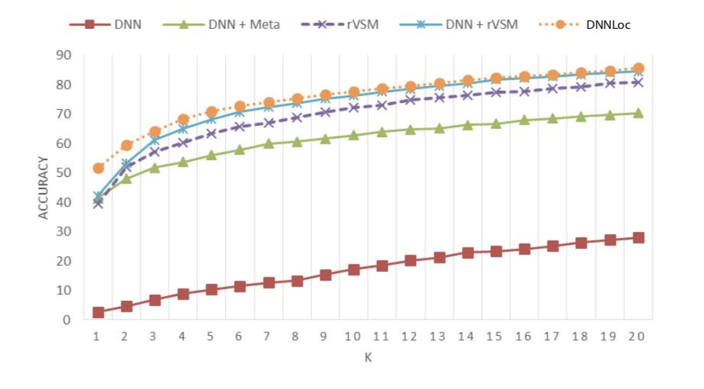
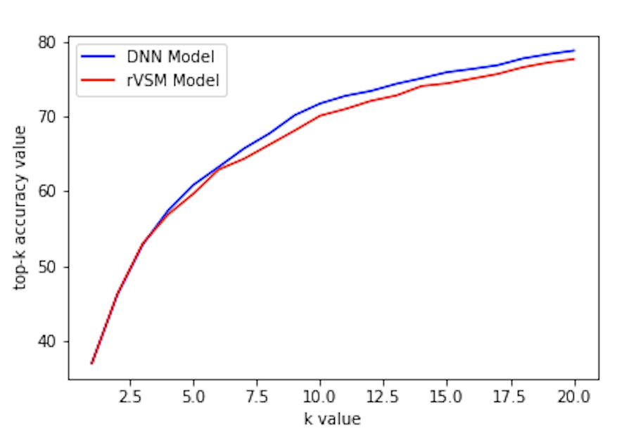

# Bug Localization by Using Bug Reports

- This study and implementation is adapted from the study [*Bug Localization with Combination of Deep Learning and Information Retrieval*](https://ieeexplore.ieee.org/document/7961519).

- Prepared by: *Emre Dogan & Hamdi Alperen Cetin*

## Dataset

- For our implementation, the dataset of *Eclipse UI Platform* is used.
	- The dataset of source files is created from the [original repository](https://github.com/eclipse/eclipse.platform.ui).
	- The bug dataset can be accessed from [here](https://github.com/logpai/bugrepo/tree/master/EclipsePlatform).

## Approach
- Before implementing this model, we prepared a survey on the machine learning applications on software bug localization area. You can find the survey from [here](./doc/survey.pdf).

- In previous studies, a cosine similartiy based information retrieval model ,rVSM, has been used and resulted with good top-k accuracy results. In our case, rVSM approach is combined with some other metadata and fed to a deep neural network to conclude withg a relevancy score between a bug report and a source code file. This final relevany scores between all bug reports and source files are kept and top-k accuracy results for k=1,5,10,20 are calculated. In the original study, top-20 accuracy is found to be about 85% where our implementation achieves a 79% top-20 accuracy.

- The top-k accruacy results for different k values from the original study & our study can be seen observed from the figures below.

Original Study                  |  Our Implementation
:------------------------------:|:------------------------------:
  |  

More details regarding to the implementation and results can be found in the [technical report](./doc/final_report.pdf).

#### Run

1. Download the corpus/projects from https://drive.google.com/drive/folders/1o8DFBHBKTaGLmTs7rDrwpBjX9J6_ZGLS?usp=sharing

2. Unzip the projects in to data/projects directory. After unzipping the directory hierachy should be like this,
--data
	|--projects
		|--bug-2
		|--bug-8
		|--bug-10
		...

3. Get your absolute_path to data/train_documents.csv, data/train_questions.csv

4. src/feature_extraction.py > Replace paths of line 82, 86 with above paths.

5. src/utils.py > do the same changes to paths

6. Run main.py

